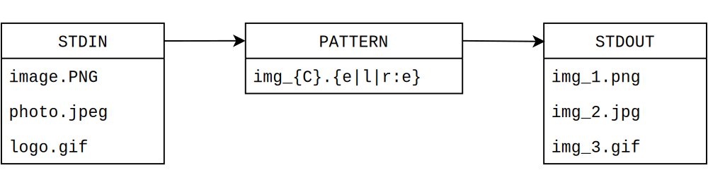

# rew

A text processing CLI tool that rewrites FS paths according to a pattern.

What `rew` does:

1. Reads values from standard [input](input.md).
2. Rewrites them according to a [pattern](pattern.md).
3. Prints results to standard [output](output.md).



Input values are assumed to be FS paths, however, `rew` is able to process any UTF-8 encoded text.

```bash
find -iname '*.jpeg' | rew 'img_{C}.{e|l|r:e}'
```

Rew is also distributed with two accompanying utilities (`mvb` and `cpb`) which move/copy files and directories, based on `rew` output.

```bash
find -iname '*.jpeg' | rew 'img_{C}.{e|l|r:e}' -d | mvb
```
